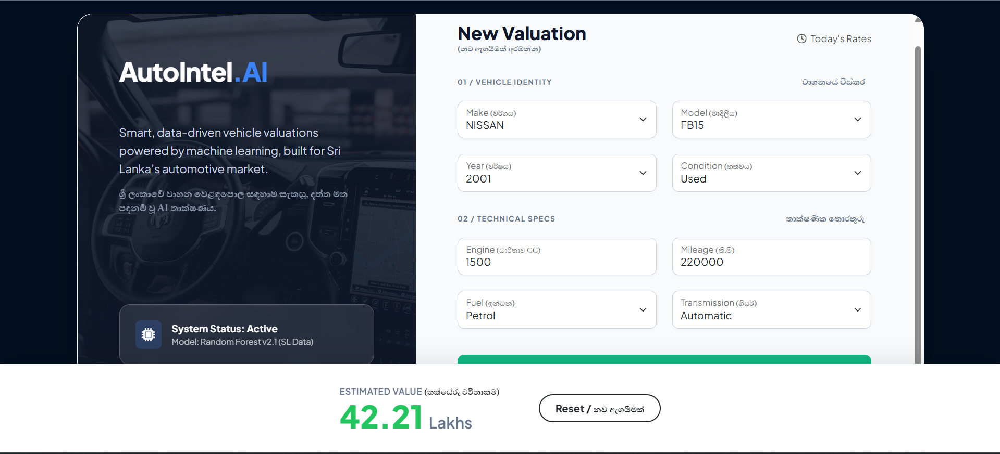

# 🚗 AutoIntel - AI Vehicle Valuation System

**AutoIntel** is a machine learning-based web application designed to predict vehicle market prices in Sri Lanka. It uses a **Random Forest Regressor** trained on historical market data to provide accurate valuations based on brand, model, year, condition, and technical specifications.



## 🚀 Features
- **High Accuracy:** ~91% R2 Score using Random Forest.
- **Sri Lankan Context:** Tailored for local market nuances (Brand, Grade, Fuel types).
- **Interactive UI:** Built with Flask and Bootstrap, featuring a professional dashboard design.
- **Bilingual Support:** Interface optimized for local users.

## 🛠️ Tech Stack
- **Python** (Pandas, NumPy)
- **Machine Learning** (Scikit-Learn)
- **Web Framework** (Flask)
- **Frontend** (HTML5, CSS3, Bootstrap 5)

## 💻 How to Run Locally

If you want to test this project on your own machine, follow these steps:

**1. Prerequisites**
Make sure you have [Python](https://www.python.org/) installed.

**2. Clone the Repository**
```bash
git clone [https://github.com/nimeth-dev/AutoIntel-Price-Predictor.git](https://github.com/nimeth-dev/AutoIntel-Price-Predictor.git)
cd AutoIntel-Price-Predictor  
```

**3. Install Dependencies**
 
    pip install -r requirements.txt


**4. Run the Application**
    python app.py


**5. Open in Browser Go to http://127.0.0.1:5000 to see the app running.**    